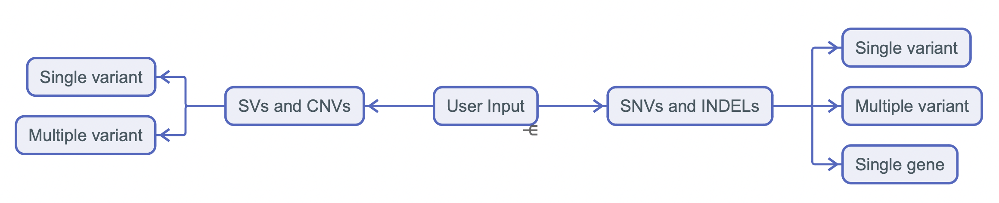

## NewGenome is a free-access versatile web server for genomic data querying and variant analysis and prioritizing with multi-omics insights. 

### Features:
1. Available for both small variants and structural variants.
2. It consolidates multi-omics data, including eQTL, pQTL, GWAS, trait, and PGx datasets, to provide holistic insights into the diverse effects of genetic variants.
3. It enables functional interpretation through gene set enrichment analysis and uncovers interactions across different biological levels by network analysis.
4. The multi-omics evidence-based scoring system and the disease-causing variant scoring system facilitate the prioritization of potentially deleterious and disease-associated variants, including structural variants. 

